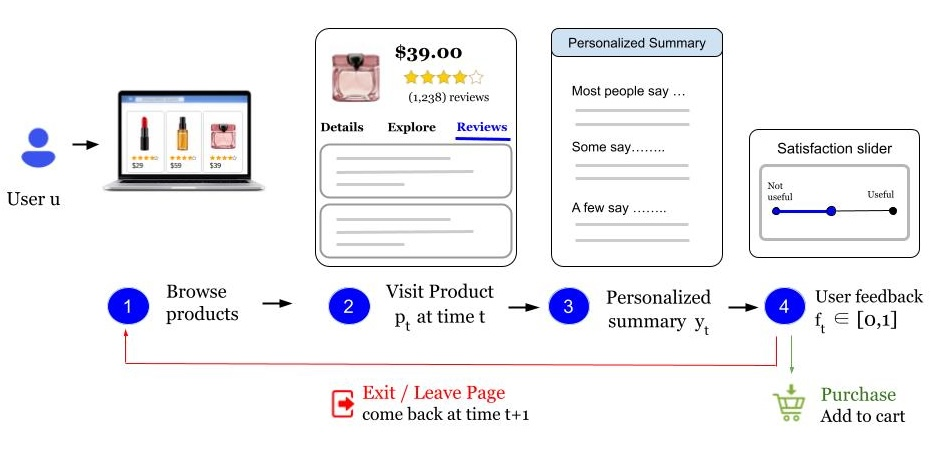
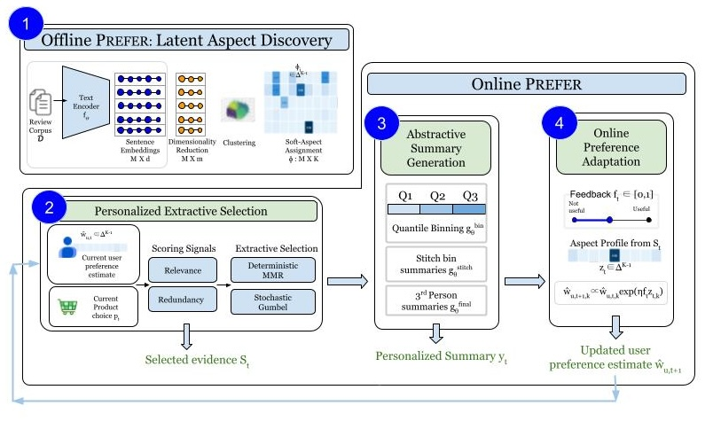

# PREFER: Personalized Review Summarization with Online Preference Learning

This repository is the official implementation of *PREFER: Personalized Review Summarization with Online Preference Learning*.

---

## Overview

PREFER is a feedback-adaptive framework for personalized product-review summarization. It frames summarization as a **sequential decision problem**: at each round the system selects and rewrites review evidence conditioned on the current estimate of the user's latent aspect preferences, receives a scalar feedback signal, and updates the preference estimate using **Entropic Online Mirror Descent (OMD)**.

### User Interaction Loop


The user sees a summary organized into **HIGH / MID / LOW** relevance paragraphs, reflecting how many reviewers emphasize each latent aspect. After reading, they provide a single scalar satisfaction score via a slider. That score drives the preference update — no explicit elicitation required.

### System Architecture
PREFER has two phases:

**Offline — Latent Aspect Discovery** (run once on the full review corpus)

**Online PREFER** (runs each round t)




---

## Requirements

Clone the repository and recreate the conda environment:

```bash
conda env create -f environment.yml
conda activate pacer
```

The environment uses **Python 3.11** and installs all dependencies via pip inside conda. Key packages:

| Package | Version | Purpose |
|---------|---------|---------|
| `torch` | 2.9.0 | Tensor operations |
| `sentence-transformers` | 5.2.0 | Review and sentence embeddings |
| `transformers` | 4.57.1 | Tokenizers and model utilities |
| `scikit-learn` | 1.7.2 | K-means clustering, PCA, metrics |
| `umap-learn` | 0.5.9 | Dimensionality reduction (notebooks) |
| `numpy` | 2.3.4 | Numerical operations |
| `pandas` | 2.3.3 | Data manipulation |
| `matplotlib` / `seaborn` | 3.10.7 / 0.13.2 | Figures |
| `nltk` | 3.9.2 | Sentence tokenization |
| `datasets` | 3.6.0 | Amazon Reviews data loading |
| `spacy` | 3.8.7 | NLP utilities (notebooks) |
| `jupyterlab` | 4.4.10 | Notebook interface |

After activating the environment, download the required NLTK tokenizer data:

```bash
python -c "import nltk; nltk.download('punkt'); nltk.download('punkt_tab')"
```

The abstractive rewriting stage requires API access to an instruction-tuned language model
(`gemma-3-4b-it` or `google/flan-t5-large`). Provide credentials via environment variable —
**never commit keys to the repository**:

```bash
export MODEL_API_KEY="your_api_key_here"
```
---

## Data

The full dataset is not included due to size and licensing constraints. PREFER is evaluated on the **ALL_BEAUTY** category of the [Amazon Reviews'23 dataset](https://amazon-reviews-2023.github.io/).

| Category | #Users | #Items | #Ratings | #Review tokens |
|----------|--------|--------|----------|----------------|
| ALL_BEAUTY | 632.0K | 112.6K | 701.5K | 31.6M |

### Step 1 — Download the raw data

Open and run `notebooks/1_embedding_matrix_creation.ipynb`. This notebook downloads the ALL_BEAUTY category from Amazon Reviews'23 and saves the preprocessed review-level and sentence-level tables as CSV files into `data/`.

### Step 2 — Create embeddings

Once the CSVs are in place, run the appropriate embedding script depending on which setup you need:

```bash
# Review-level embeddings (K=20 aspects, used in notebooks)
python scripts/create_review_embeddings.py --input_dir data --output_dir outputs

# Sentence-level embeddings (K=10 aspects, used in main experiments)
python scripts/create_sentence_embeddings.py --input_dir data --output_dir outputs --splits train
```

Both scripts encode text using `sentence-transformers/all-MiniLM-L6-v2` (d=384) and save `.npy` embedding matrices alongside the processed CSVs. The sentence-level pipeline additionally splits reviews into sentences, filters short sentences, and caps the number of sentences per review.

Preprocessed corpus statistics:

| Statistic | Review-level | Sentence-level |
|-----------|-------------|----------------|
| Number of text units | 583,190 | 1,336,813 |
| Mean words per unit | 32.8 | 13.3 |
| Mean units per user | 1.09 | 2.84 |
| Max units per product | 1,809 | 4,852 |

Place raw or sample data in `data/`. Do **not** commit large raw files.

---

## Aspect Discovery

Once embeddings are created, the next step is to discover the latent aspect space from the review corpus. This is an **offline, one-time step** that produces the soft aspect-score vectors ϕᵢ ∈ Δᴷ⁻¹ used by all downstream extraction and preference-learning components.

The pipeline follows three stages inside the notebooks:

1. **Dimensionality reduction** — PCA is applied to the normalized embedding matrix, retaining the top *m* principal components. The number of components is chosen empirically using the cumulative explained-variance curve.
2. **Clustering** — K-means is run on the reduced embeddings. The number of clusters *K* is selected using internal clustering diagnostics (Silhouette score, Calinski-Harabasz index, Davies-Bouldin index).
3. **Soft aspect assignment** — each sentence/review is assigned a soft membership vector over the *K* cluster centroids via a distance-based softmax: ϕᵢ,ₖ ∝ exp(−τ ‖s̃ᵢᴾᶜᴬ − cₖ‖²), where τ is calibrated so that a median-gap sentence assigns its nearest aspect approximately *r* times the weight of the second-nearest.

Run the appropriate notebook depending on the granularity:

| Notebook | Input embeddings | Chosen K | Output |
|----------|-----------------|----------|--------|
| `notebooks/2_embeddingmatr_to_clustering.ipynb` | Review-level `.npy` | K = 20 | Aspect scores appended to review-level CSV |
| `notebooks/2_with_sentenceembeddings.ipynb` | Sentence-level `.npy` | K = 10 | `data/train_with_aspect_scores_sentences.csv` |

The sentence-level setup (K = 10) is used for all main experiments. Sentence-level units produce more localized semantic structure than full reviews — clusters are more separable in PCA space and soft memberships are sharper — which yields cleaner aspect disentanglement for downstream preference learning.

After running `notebooks/2_with_sentenceembeddings.ipynb`, the file `data/train_with_aspect_scores_sentences.csv` will contain the `asp_00` … `asp_09` columns required by all experiment scripts. Hence, the main experiment scripts expect the following file at:

```
data/train_with_aspect_scores_sentences.csv
```

Required columns:

| Column | Description |
|--------|-------------|
| `user_id` | Unique reviewer identifier |
| `parent_asin` | Product identifier |
| `sentence` | Sentence text |
| `asp_00` … `asp_{K-1}` | Soft aspect scores ϕᵢ ∈ Δᴷ⁻¹ |
| `global_idx` | Row index (added automatically if absent) |
| `len` | Token length (added automatically if absent) |

---

## Training

PREFER does not have a conventional offline training phase. The preference learning is entirely online: preferences are initialized uniformly and updated from scalar feedback round by round.

### Cross-User Heterogeneity (Table 2 in paper)

For a fixed product, conditioning the extractor on different preference vectors produces meaningfully different summaries. The cosine alignment between the target preference ŵ and the selected-evidence profile z confirms that the extractor steers evidence appropriately:

| Target preference ŵ | Gcos(ŵ, z) | Latent aspect focus |
|---------------------|------------|---------------------|
| Aspect-0 (e₀) | **0.9995** | Visual presentation, color variety, giftability |
| Aspect-2 (e₂) | **0.9914** | Exfoliation effectiveness, body-use suitability |
| Mixed (½e₀ + ½e₂) | 0.7527 | Exfoliating quality and color variety combined |
| Generic (uniform 1/K) | 0.9897 | Broad product-level usability |

> Reproduce with: `python scripts/anecdotes.py`


### Main Experiment — Multi-seed Convergence (Figure 2, 13 & 14 in paper)

```bash
python scripts/run_convergence_seeds.py
```

This sweeps over 10 seeds × {MMR, Gumbel} × {Static, Online} policies × 100 rounds. Key hyperparameters (set in `COMMON_PARAMS` inside the script):

| Parameter | Value | Description |
|-----------|-------|-------------|
| `eta_omd` | 2.59 | Initial OMD learning rate η₀ |
| `c_eta` | 0.05 | Step-size decay (ηₜ = η₀ / √(c_η·t+1)) |
| `clip_centered_feedback` | 0.15 | Clipping bound c on centered feedback f̃ₜ |
| `delta_omd` | 1e-4 | Truncated-simplex floor δ |
| `beta_init` | 8.0 | Inverse temperature for Boltzmann bootstrap |
| `gamma` (feedback) | 12.0 | Feedback sensitivity parameter |
| `k` | 10 | Max sentences selected per round |
| `L` | 1,000 | Token-length extraction budget |
| `tau_alpha` | 20 | Temperature for importance weights αₜ |

### Preference-Drift Experiment (Figure 3, 15, 16, 17 & 18 in paper)

```bash
python scripts/run_preference_drift.py
```

Simulates a linear drift from one latent aspect to another over a configurable window (`DRIFT_START=20`, `DRIFT_END=90` out of 200 rounds).

### Single Diagnostic Run (with inline plots)

```bash
python scripts/run_gumbel.py    # Gumbel extractor, single seed
python scripts/run_mmr.py       # MMR extractor, single seed
```

---

## Evaluation

All evaluation metrics are computed inline during the online loop and written to CSV files in `outputs/`. Figures are saved automatically to `figures_finalrun/` and `figures/preference_drift/`.

Key metrics logged per round:

| Metric | Symbol | Description |
|--------|--------|-------------|
| Evidence alignment | *Aᵉᵛⁱᵈ_{t}* | Cosine(wᵤ, zₜ) — alignment of selected evidence with oracle |
| Preference alignment | *Aᵖʳᵉᶠ_{t}* | Cosine(wᵤ, ŵᵤ,ₜ) — alignment of learned profile with oracle |
| Surrogate regret | *R_{t}* | Cumulative OMD surrogate loss gap vs. oracle |
| Avg. surrogate regret | *R_{t}/t* | Per-round average (theory: → 0 as t → ∞) |
| Theoretical bound | — | O(√t) bound from Theorem 2 |
| Min coordinate | minₖ ŵₜ,ₖ | Truncated-simplex feasibility (must stay ≥ δ) |
| KL divergence | KL(ŵ ‖ w*) | KL from estimated to oracle preference |

Output files:

```
outputs/convergence_seeds_finalrun/convergence_all_runs.csv
outputs/convergence_seeds_finalrun/regret_all_online_runs.csv
outputs/convergence_seeds_finalrun/omd_regret_diagnostics.csv
outputs/preference_drift/preference_drift_all_runs.csv
outputs/preference_drift/preference_drift_diagnostics.csv
outputs/history_gumbel.jsonl    (single-run interaction history)
```

---

## Pre-trained Models

PREFER does not train a neural model from scratch. The only model weights used are:

- **Sentence embeddings**: `sentence-transformers/all-MiniLM-L6-v2` — downloaded automatically by the `sentence-transformers` library on first use.
- **Rewriting**: `gemma-3-4b-it` or `google/flan-t5-large` — accessed via API; no local checkpoint needed.
- **Saved preference vectors**: stored in `weights/` and `outputs/*.jsonl` if applicable.


---

## ML Code Completeness Checklist

Following the [Papers with Code ML Code Completeness Checklist](https://github.com/paperswithcode/releasing-research-code):

- [x] **Specification of dependencies** — `requirements.txt` and `requirements_colab.txt` provided.
- [x] **Training / experiment code** — `scripts/run_convergence_seeds.py` and `scripts/run_preference_drift.py` reproduce all main results with documented hyperparameters.
- [x] **Evaluation code** — metrics computed inline and written to `outputs/`; figures saved automatically to `figures/`.
- [ ] **Pre-trained models** — not applicable; PREFER uses `sentence-transformers/all-MiniLM-L6-v2` (downloaded automatically) and a prompted LLM API (no local checkpoint needed).
- [x] **README with results table and precise reproduction commands** — see Results section above.

---

## Limitations

As discussed in the paper (Section 7):

- Feedback is **synthetically generated** — results reflect controlled simulations rather than a deployed system with real users.
- Discovered aspects are **latent** (inferred via K-means) rather than human-labeled; semantic interpretation requires manual inspection.
- The rewriting module relies on **prompted LLM calls** that may introduce hallucination or over-compression.

Future work should incorporate real user feedback, human- or weakly-supervised aspect interpretation, stronger factuality constraints, and richer feedback signals (clicks, dwell time, natural-language critiques).

---

## License

This repository is released under the **MIT License**.